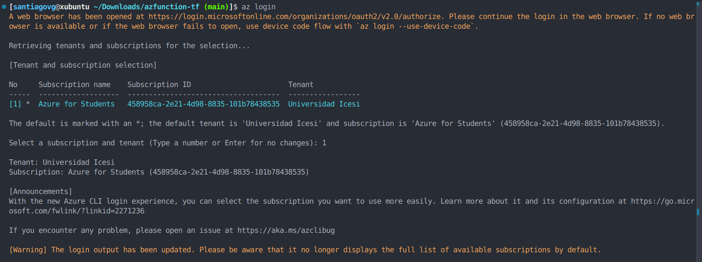

# Lab Terraform

**Estudiante:** Santiago Valencia García - A00395902

**Profesor:** Christian David Flor Astudillo

**Fecha:** 10 de septiembre de 2025

**Asignatura:** Ingeniería de Software V

**Facultad Barberi de Ingeniería, Diseño y Ciencias Aplicadas**

**Universidad Icesi. Cali, Valle del Cauca, Colombia**

# Introducción

El presente informe de laboratorio documenta el proceso de despliegue de una infraestructura en la nube de Microsoft Azure. El objetivo principal es utilizar Terraform, una herramienta de Infraestructura como Código (IaC), para aprovisionar de manera automatizada los recursos necesarios para una aplicación de funciones (Azure Function App). Se detallará cada paso del procedimiento, desde la autenticación en la plataforma de Azure mediante la CLI, pasando por la inicialización y aplicación de la configuración de Terraform, hasta la verificación final del correcto funcionamiento del servicio desplegado.

# Desarrollo del informe

### **1. Configuración Inicial y Autenticación en Azure**

El proceso comienza con la autenticación en la interfaz de línea de comandos (CLI) de Azure para obtener los permisos necesarios. Se ejecuta el comando `az login`, que redirige a un navegador web para una autenticación segura. Una vez autenticado, la CLI presenta las suscripciones disponibles, seleccionando para este caso la de "Azure for Students" ligada al tenant de la "Universidad Icesi".

Para asegurar que la configuración es correcta, se ejecuta el comando `az account show`. Este confirma los detalles de la cuenta activa, como el ID de la suscripción, el nombre ("Azure for Students") y el tenant asociado.

### **2. Inicialización y Validación del Proyecto de Terraform**

Con la sesión de Azure activa, se prepara el entorno de Terraform. Primero, se ejecuta `terraform init` para inicializar el directorio de trabajo. Este comando descarga el proveedor requerido, `hashicorp/azurerm` . A continuación, se valida la sintaxis del código de infraestructura con `terraform validate`, el cual confirma que la configuración es sintácticamente correcta y no presenta errores. La estructura del proyecto contiene un archivo principal `main.tf` , donde se define el proveedor `azurerm` con el ID de la suscripción y se declaran los recursos a crear, como el grupo de recursos inicial.

### **3. Planificación y Aplicación de la Infraestructura**

Se procede a generar un plan de ejecución con `terraform plan`. El sistema solicita el nombre para la función, para el cual se ingresa el valor `valenciagmyfirstfunc`. Antes de esto, se añade el campo `subscription_id` con el id que obtiene en la información de la cuenta. Terraform analiza el estado actual y genera un plan que detalla los recursos que serán creados.

Para ejecutar el plan, se utiliza el comando `terraform apply`. Tras ingresar nuevamente el nombre de la función y confirmar la operación con `yes`, Terraform inicia el aprovisionamiento de los recursos en Azure. La terminal muestra el progreso en tiempo real:

El proceso concluye con el mensaje "Apply complete!", informando que los recursos fueron añadidos, y muestra la URL de la función como resultado (`output`).

### **4. Verificación del Despliegue**

La etapa final es la verificación de que todos los componentes están desplegados y funcionando correctamente.

**Verificación en el Portal de Azure:** Se accede al portal de Microsoft Azure, donde se confirma la existencia del nuevo grupo de recursos llamado `valenciagmyfirstfunc`. Dentro de este, se observan los recursos aprovisionados: la cuenta de almacenamiento (`Storage account`), el plan de servicio (`App Service plan`) y la aplicación de funciones (`Function App`).

En los detalles de la Function App dentro del portal, la sección "Essentials" confirma que el estado del recurso es Running y la lista de funciones muestra la `valenciagmyfirstfunc` con un disparador (trigger) de tipo HTTP.

**Prueba de Funcionamiento:** Se accede a la URL de la función. El navegador muestra el mensaje "This HTTP triggered function executed successfully...", confirmando que la función está en línea y responde correctamente a las peticiones. Adicionalmente, la URL base de la aplicación muestra la página de bienvenida de Azure, indicando "Your Functions 4.0 app is up and running".

# Conclusión

El laboratorio concluyó exitosamente, cumpliendo el objetivo de desplegar una Azure Function App utilizando Terraform. Se aprovisionaron los recursos de forma automatizada y se verificó que la aplicación se encuentra en estado "Running" y responde a peticiones HTTP.
