# Laboratorio de Terraform

**Estudiante:** Danna Valentina López Muñoz
**Código:** A00395902
**Profesor:** Christian David Flor Astudillo
**Asignatura:** Ingeniería de Software V
**Universidad Icesi, Facultad Barberi de Ingeniería, Diseño y Ciencias Aplicadas**

# Contexto

Durante este laboratorio se realizara el proceso de despliegue de una infraestructura en la nube de Azure usando Terraform. Lo que se busaca es incentivar la compresión de cómo la infraestructura en la nube puede ser definida, versionada y gestionada de manera declarativa, en lugar de realizar configuraciones manuales desde el portal de Azure.

# Pasos

## 1. Autenticación en Azure

Se ejecuta el comando `az login`para autenticarse y escoger la suscripción con la que se trabajara, en este caso será "Azure for Students".
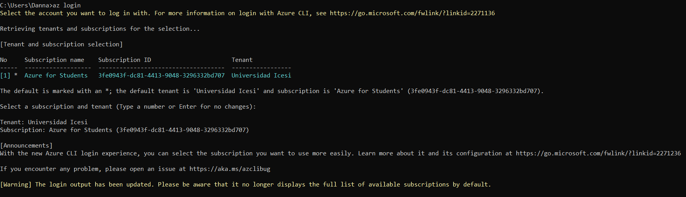

Y validamos que las configuraciones de la cuenta sean correctas con el comando `az account show`
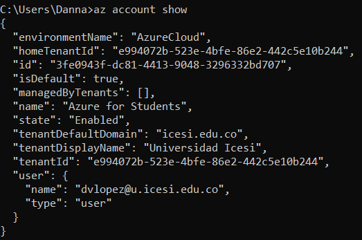

Una vez que se ha validado que la cuenta está activa y la suscripción es la seleccionada, se puede proceder a crear el proyecto de Terraform.

## 2. Inicialización de Terraform

Posicionandose en la carpeta raíz del directorio, se ejecuta el comando `terraform init` que descarga proveedores, módulos y configura el backend.
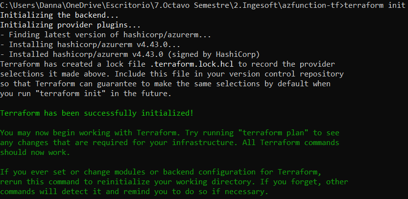

## 3. Añadir subscripción de azure en el provider

En el archivo main.tf, debajo de la línea features{} se agrega la variable subscription_id que tendrá el valor de la variable id obtenida del comando `az account show` del primer paso y validamos que la sintaxis y configuración permanezcan correctas.
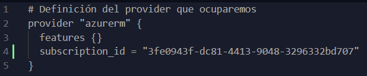 
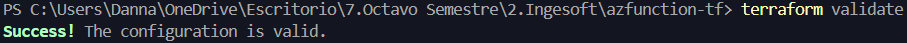

## 4. Planificación de la infraestructura

Se genera un plan de ejecución con el comando `terraform plan` que compara la configuración definida en los archivos .tf con el estado real de la infraestructura existente en Azure y genera un plan de ejecución de los cambios que se llevaran a cabo al aplicar la configuración. Este paso es para verificar que los cambios en la infraestructura coincidan con el resultado esperado antes de hacer modificaciones.
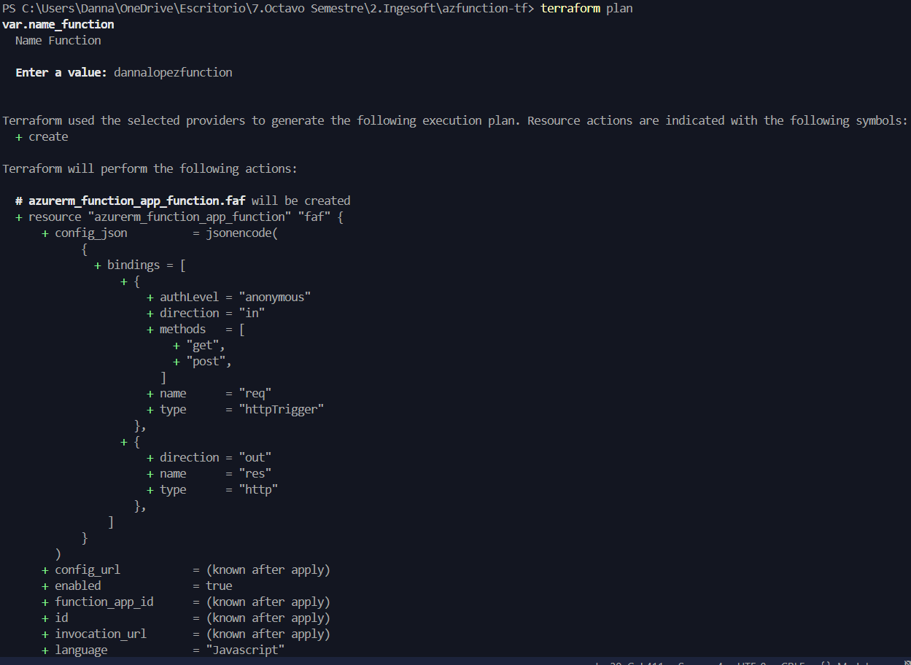

## 5. Aplicación del plan de la infraestructura

Se utiliza el comando `terraform apply` para ejecutar el plan y aplicarlo sobre la infraestructura, el comando solicita ingresar nuevamente el nombre de la función y confirmar la operación con yes, así Terraform aprovisiona los recursos en Azure según lo definido en los archivos .tf. 

En mi caso, tuve que crear el archivo dev.tfvars para definir los nombres de los recursos y usar el comando `terraform apply --var-file="dev.tfvars` porque algunos fallaban al momento de crearse, 
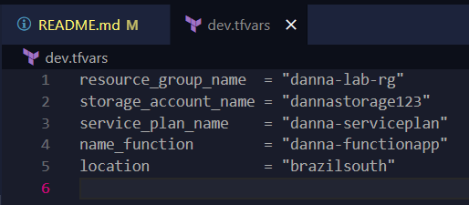
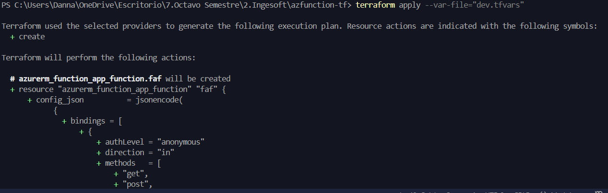
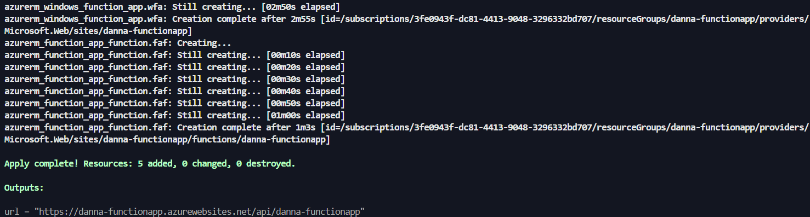

## 6. Verificación de funcionamiento

En el portal de azure, en el apartado de grupo de recursos, se selecciona el recurso creado (en este caso se llama danna-functionapp) y se puede apreciar que contiene tres recursos; una aplicación de funciones, un plan de App Service y una cuenta de almacenamiento.
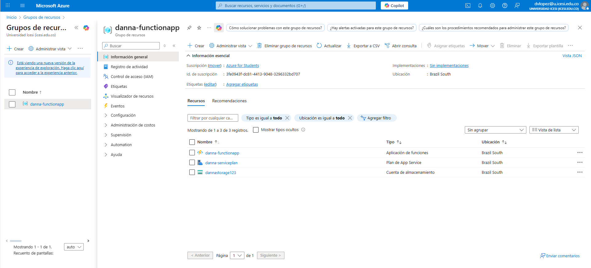 

Accedemos al url que aparece en el recurso aplicación de funciones (`https://danna-functionapp.azurewebsites.net`)
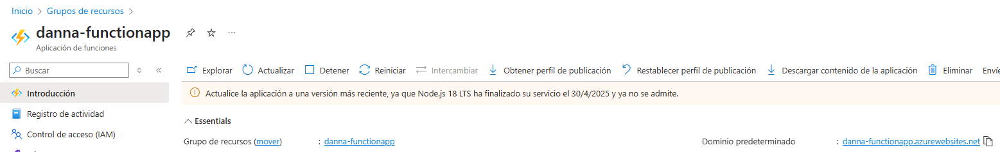

Y vemos que está funcionando correctamente
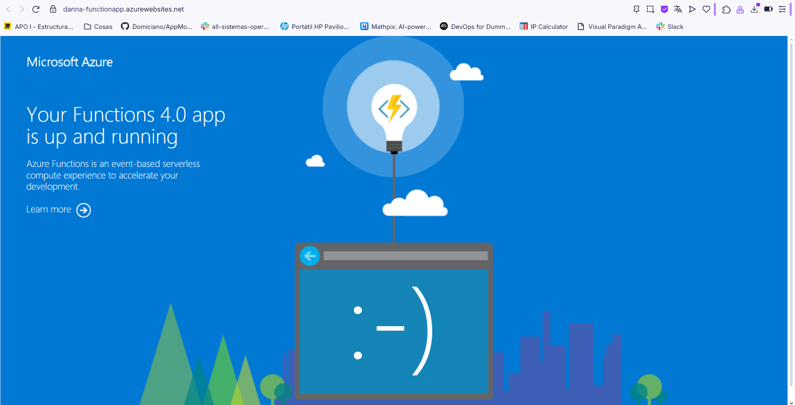

Accedemos también al url que nos resulto como outputs al aplicar el plan (`https://danna-functionapp.azurewebsites.net/api/danna-functionapp`) 
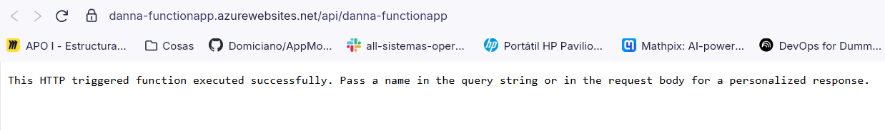

Y la función de trigger responde correctamente a peticiones. Por lo que podemos concluir que se desplego de manera exitosa en Azure utilizando Terraform.
